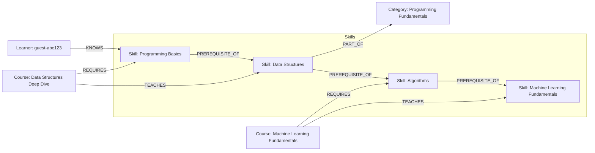

# SkillPath

A learning-path planner: given the skills you already know and the skill you want next, it walks
a graph of skills, prerequisites and courses to plot the exact sequence of steps between the two.

Built for the Wexa AI take-home assignment, backed by **CognoDB** (a managed graph database
speaking openCypher over Bolt) via the official `neo4j-driver`.

- **Live demo:** _add your hosted URL here_
- **Screen recording:** _add your recording link here_

## Why a graph database?

Skills unlock other skills, and courses teach or require them — that's a network, not a table.
Two things a relational schema makes painful and CognoDB makes native:

1. **Arbitrary-depth prerequisite chains.** "What do I need to learn before Computer Vision?"
   might be 1 hop away or 6 (`Programming Basics → Variables & Control Flow → Functions & Scope →
   Data Structures → Algorithms → Machine Learning Fundamentals → Deep Learning → Computer
   Vision`). In SQL that's a recursive CTE per query, and the recursion depth is unbounded — you
   don't know how many `JOIN`s to write ahead of time. In Cypher it's one pattern:
   `(ancestor)-[:PREREQUISITE_OF*1..10]->(target)`.

2. **Personalized traversal minus a set, joined to another table, per request.** The path-finder
   feature (["What should I learn next to reach skill X, given I already know A, B, C?"](#the-personalized-learning-path))
   combines a variable-length traversal, a `NOT IN` set-difference against the learner's known
   skills, and a "cheapest course per skill" join — recomputed fresh every time a learner checks
   off a new skill. Modeling this relationally means a recursive CTE, a `LEFT JOIN` against
   courses, and a window function for "cheapest course," re-planned by the query optimizer on
   every request. As a graph traversal it reads the way you'd explain it out loud.

Rows-and-joins are still the right tool for the `Course` and `Skill` *attributes* themselves
(title, hours, level) — CognoDB stores those too, as node properties. What changes is how the
*connections* between them are queried, which is the part of this problem that actually matters.

## Data model



**Labels & key properties**

| Label      | Properties                                      |
| ---------- | ------------------------------------------------ |
| `Skill`    | `name` (unique), `level`, `description`           |
| `Course`   | `title` (unique), `provider`, `hours`, `level`, `description` |
| `Category` | `name` (unique)                                   |
| `Learner`  | `email` (unique), `name`                          |

**Relationships**

| Relationship             | Direction                        | Meaning                                  |
| ------------------------ | --------------------------------- | ----------------------------------------- |
| `(:Skill)-[:PREREQUISITE_OF]->(:Skill)` | prerequisite → dependent | Skill A must come before skill B |
| `(:Course)-[:TEACHES]->(:Skill)`        | course → skill            | Completing the course grants the skill |
| `(:Course)-[:REQUIRES]->(:Skill)`       | course → skill            | The course assumes you already have this skill |
| `(:Skill)-[:PART_OF]->(:Category)`      | skill → category          | Groups skills for browsing |
| `(:Learner)-[:KNOWS]->(:Skill)`         | learner → skill           | The learner already has this skill |

The seed data models a real-world tech curriculum: ~45 skills across 7 categories (Programming
Fundamentals, Web Development, Data & Databases, Data Science & ML, DevOps & Cloud, Systems &
Networking, Mobile Development) and ~50 courses from providers like Coursera, Udemy and
freeCodeCamp, each teaching and/or requiring specific skills.

## Project structure

```
cognodb-skillpath/
├── scripts/
│   ├── seed-data.ts      # skill/course/category source data
│   └── seed.ts           # loads it into CognoDB (parameterized, idempotent)
├── src/
│   ├── lib/
│   │   ├── neo4j.ts       # driver singleton, session helpers, DatabaseUnavailableError
│   │   ├── queries.ts     # every Cypher query, parameterized
│   │   ├── types.ts       # shared TS types for query results
│   │   └── api-helpers.ts # route error handling (503 on DB outage)
│   ├── components/        # Nav, LearnerProvider (client-side identity), UI primitives
│   └── app/
│       ├── page.tsx               # dashboard
│       ├── skills/page.tsx        # browse/filter skills
│       ├── skills/[name]/page.tsx # skill detail + full prerequisite chain
│       ├── path/page.tsx          # path finder
│       ├── profile/page.tsx       # manage known skills, see course recommendations
│       └── api/                   # route handlers backing the client pages
```

## Setup

### 1. Create a CognoDB Cloud instance

1. Sign up at [console.cognodb.com/signup](https://console.cognodb.com/signup) (free, no card).
2. Create a free (`c0`) instance and pick a region — it provisions in under a minute.
3. Copy the `bolt+s://<instance-id>.databases.cognodb.cloud` URI and the generated password for
   user `cognodb`. **The password is shown once** — save it now.

### 2. Configure the app

```bash
cd cognodb-skillpath
cp .env.example .env.local
```

Fill in `.env.local`:

```
NEO4J_URI=bolt+s://<instance-id>.databases.cognodb.cloud
NEO4J_USERNAME=cognodb
NEO4J_PASSWORD=<your generated password>
```

### 3. Install, seed, run

```bash
npm install
npm run seed   # clears the graph and loads the sample skill/course catalog
npm run dev    # http://localhost:3000
```

`npm run seed` connects with the official driver, wipes any existing graph, creates uniqueness
constraints, then loads categories, skills, courses and their relationships with parameterized,
batched `UNWIND` writes (see [scripts/seed.ts](scripts/seed.ts)).

### 4. Build & deploy

```bash
npm run build
npm run start
```

Deploy to any Node.js host (Vercel, Render, Railway, Fly.io, …); set the same three environment
variables in that platform's dashboard. Never commit `.env.local` — it's gitignored.

## The main queries

All queries live in [`src/lib/queries.ts`](src/lib/queries.ts) and run through the official
`neo4j-driver`'s parameterized `session.run(cypher, params)` — no string concatenation anywhere.

### The full prerequisite chain (multi-hop traversal)

```cypher
MATCH (target:Skill {name: $name})
MATCH path = (ancestor:Skill)-[:PREREQUISITE_OF*1..10]->(target)
WITH ancestor, min(length(path)) AS depth
RETURN ancestor.name AS name, ancestor.level AS level, ancestor.description AS description, depth
ORDER BY depth ASC, name ASC
```

Shown on every skill's detail page as a step diagram. Depth is however many hops separate that
ancestor from the target — some skills are 1 hop away, some are 5 or 6.

### The personalized learning path

The flagship "a relational database would find this awkward" query — variable-length graph
reachability, a set-difference against what the learner already knows, and a per-skill
cheapest-course lookup, all in one traversal:

```cypher
MATCH (target:Skill {name: $target})
MATCH path = (skillNode:Skill)-[:PREREQUISITE_OF*0..10]->(target)
WITH skillNode, min(length(path)) AS hopsToTarget
WHERE NOT skillNode.name IN $known
OPTIONAL MATCH (course:Course)-[:TEACHES]->(skillNode)
WITH skillNode, hopsToTarget, course
ORDER BY course.hours ASC
WITH skillNode, hopsToTarget, collect(course)[0] AS bestCourse
RETURN skillNode.name AS ..., hopsToTarget, bestCourse.title AS ...
ORDER BY hopsToTarget DESC, skillNode.name ASC
```

Used by the [path finder](src/app/path/page.tsx): pick a target skill, and it returns the ordered
list of only the skills you don't already have, foundational-first, each paired with the
cheapest (fewest-hours) course that teaches it.

### Courses you're ready for right now

```cypher
MATCH (course:Course)
OPTIONAL MATCH (course)-[:REQUIRES]->(req:Skill)
WITH course, collect(req.name) AS requiredSkills
WHERE ALL(r IN requiredSkills WHERE r IN $known)
MATCH (course)-[:TEACHES]->(taught:Skill)
WITH course, requiredSkills, collect(DISTINCT taught.name) AS teachesSkills
WHERE ANY(t IN teachesSkills WHERE NOT t IN $known)
RETURN course.title AS ..., requiredSkills, teachesSkills
ORDER BY course.hours ASC
```

Every `REQUIRES` skill already known (`ALL(...)`), and at least one `TEACHES` skill still missing
(`ANY(...)`) — a double set-membership check across a join, shown on the [profile page](src/app/profile/page.tsx).

## Engineering notes

- **Secrets**: `NEO4J_URI` / `NEO4J_USERNAME` / `NEO4J_PASSWORD` are read from environment
  variables only (`src/lib/neo4j.ts`); `.env.local` is gitignored.
- **Error handling**: every query goes through `withSession()`, which wraps driver/connection
  failures in a `DatabaseUnavailableError`. Server pages catch it and render a friendly "CognoDB
  is unreachable" state instead of crashing; API routes return a `503` with the same message. The
  nav bar also polls `/api/health` every 30s and shows a live connectivity indicator.
- **Identity without login**: a lightweight guest identity (a generated email) is created in
  `localStorage` on first visit and used to scope `KNOWS` relationships per learner — no auth
  flow needed for a demo, while still keeping "what you know" as real graph state in CognoDB
  rather than only in the browser.

## Screenshots

_Add screenshots of the dashboard, skill detail (prerequisite chain), path finder and profile
pages here before submitting._
