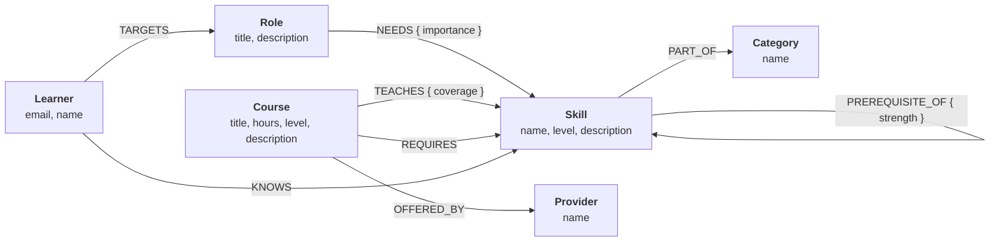

# SkillPath

**A career learning-path planner built on a graph.** Tell it the role you want and the skills you
already have; it walks a graph of skills, prerequisites, courses and roles to produce the exact
ordered sequence of steps between the two.

Built for the Wexa AI take-home assignment, backed by **CognoDB** — a managed graph database
speaking openCypher over Bolt — through the official `neo4j-driver`.

- **Live demo:** **[cognodb-skillpath.vercel.app](https://cognodb-skillpath.vercel.app)** — running against a live CognoDB instance
- **Screen recording:** _add your recording link here_

---

## Why a graph database?

The question this app exists to answer is *“what should I learn next to become a Machine Learning
Engineer, given what I already know?”* That is a **traversal**, not a lookup.

Answering it means, in one pass:

1. fan out from a `Role` across its `NEEDS` edges to the skills that role requires;
2. expand every one of those skills into its **full prerequisite closure** — a chain that runs up
   to six hops deep in this dataset, and whose depth isn't known in advance;
3. subtract every skill the learner already `KNOWS`;
4. rank what's left by how many of *its own* prerequisites are still unmet, and attach the
   shortest course that teaches it.

**In Cypher that is a single query** ([`getPathToRole`](src/lib/queries.ts)), because the depth of
step 2 is expressed as `[:PREREQUISITE_OF*0..8]` rather than as a fixed number of joins.

**In a relational schema it is genuinely awkward.** Step 2 needs a recursive CTE seeded from the
join in step 1. Step 4 needs a *second*, correlated recursive count evaluated per surviving row,
plus a window function to pick the cheapest course. And none of it can be usefully cached, because
`$known` changes the moment a learner ticks one more checkbox — so the whole recursion is replanned
on every request. The recursion depth is the real problem: with `PREREQUISITE_OF` being a DAG of
unbounded depth, there is no fixed number of `JOIN`s you can write ahead of time.

A second query makes the same point from a different angle. The prerequisite chain shown on every
skill page distinguishes *blocking* prerequisites from *recommended* ones by asking whether **every
edge along a path** carries `strength: 'hard'`:

```cypher
ALL(r IN relationships(path) WHERE r.strength = 'hard')
```

That is a predicate over the edges of a variable-length path. In SQL, edge properties along a
recursive path have to be threaded through the CTE by hand as accumulator columns.

Rows and joins are still the right tool for the *attributes* — a course's title, hours and level.
CognoDB stores those too, as node properties. What changes is how the **connections** are queried,
and connections are the entire point of this problem.

---

## The data model

The model is the centre of this submission, so it's worth reading closely.



### Nodes

| Label      | Properties                                          | Purpose |
| ---------- | --------------------------------------------------- | ------- |
| `Skill`    | `name` *(unique)*, `level`, `description`            | The unit everything else connects through |
| `Course`   | `title` *(unique)*, `hours`, `level`, `description`  | A concrete way to acquire a skill |
| `Role`     | `title` *(unique)*, `description`                    | A career target — what a learner is aiming at |
| `Provider` | `name` *(unique)*                                    | Who offers a course |
| `Category` | `name` *(unique)*                                    | Groups skills for browsing |
| `Learner`  | `email` *(unique)*, `name`                           | A person and their current state |

`Provider` is modelled as a node rather than a string property on `Course` deliberately: it turns
“which providers cover the gaps in my path?” into a traversal instead of a `GROUP BY` over a
denormalised column.

### Relationships

| Relationship                            | Properties                              | Meaning |
| --------------------------------------- | --------------------------------------- | ------- |
| `(Skill)-[:PREREQUISITE_OF]->(Skill)`   | `strength: 'hard' \| 'recommended'`     | A must come before B — or merely helps |
| `(Role)-[:NEEDS]->(Skill)`              | `importance: 'core' \| 'nice-to-have'`  | The role requires this skill, or values it |
| `(Course)-[:TEACHES]->(Skill)`          | `coverage: 'primary' \| 'partial'`      | The course fully teaches it, or touches it |
| `(Course)-[:REQUIRES]->(Skill)`         | —                                       | Enrolment assumes this skill already |
| `(Course)-[:OFFERED_BY]->(Provider)`    | —                                       | Who runs the course |
| `(Skill)-[:PART_OF]->(Category)`        | —                                       | Browsing taxonomy |
| `(Learner)-[:KNOWS]->(Skill)`           | —                                       | The learner already has this skill |
| `(Learner)-[:TARGETS]->(Role)`          | —                                       | The learner's chosen goal |

### Why the relationship properties matter

The three edge properties are what make the traversals *interesting* rather than mechanical — they
let one graph answer several different questions:

- **`strength` on `PREREQUISITE_OF`** separates “you cannot start this without X” from “X would
  help.” Path generation follows only `hard` edges, so a learner is never told a nice-to-have is
  blocking them — but the skill page still *shows* recommended links, rendered with a dashed border.
- **`importance` on `NEEDS`** lets the same role power both a strict path (core only) and an
  expanded one, via a checkbox on the role page, without a second query.
- **`coverage` on `TEACHES`** stops a course that merely *mentions* a topic from being recommended
  as the way to learn it — path generation filters to `coverage = 'primary'`.

Putting these on the *edges* rather than the nodes is the key modelling decision: “hard” is not a
property of a skill, it's a property of the relationship between two specific skills. Data
Structures is a hard prerequisite for Algorithms and a recommended one elsewhere.

### The seeded dataset

Realistic tech-curriculum data, sized well within the free `c0` tier:

| | Count | | Count |
|---|---|---|---|
| Skills | 48 | `PREREQUISITE_OF` | 78 |
| Courses | 48 | `NEEDS` | 69 |
| Roles | 9 | `REQUIRES` | 63 |
| Providers | 13 | `TEACHES` | 58 |
| Categories | 7 | `PART_OF` / `OFFERED_BY` | 48 / 48 |
| | | **Total relationships** | **372** |

Nine roles (Frontend, Backend, Full-Stack, Data Analyst, ML Engineer, Data Engineer, DevOps, SRE,
Mobile) across seven categories, with courses from Coursera, Udemy, freeCodeCamp, DataCamp, MIT
OpenCourseWare and others. The deepest prerequisite chain — Computer Vision — is **6 hops**.

---

## Setup

### 1. Create a CognoDB instance

1. Sign up at [console.cognodb.com/signup](https://console.cognodb.com/signup) — free, no card.
2. Create a free (`c0`) instance and pick a region; it provisions in under a minute.
3. Copy the `bolt+s://…` connection URI and the generated password for user `cognodb`.
   **The password is shown exactly once** — save it immediately.

### 2. Configure

```bash
cp .env.example .env.local
```

```dotenv
NEO4J_URI=bolt+s://<instance-id>.databases.cognodb.com
NEO4J_USERNAME=cognodb
NEO4J_PASSWORD=<your generated password>
```

`.env.local` is gitignored and never committed.

### 3. Install, seed, run

```bash
npm install
npm run seed    # loads the graph (clears any existing data first)
npm run check   # optional: runs every app query and prints the results
npm run dev     # http://localhost:3000
```

`npm run seed` prints a summary of what it created:

```
✓ Creating 48 skills
✓ Linking 78 skill prerequisites
✓ Linking 69 role skill requirements
...
── Graph summary ──
Nodes:        Category 7 · Course 48 · Learner 1 · Provider 13 · Role 9 · Skill 48
Relationships: KNOWS 7 · NEEDS 69 · OFFERED_BY 48 · PART_OF 48 ·
               PREREQUISITE_OF 78 · REQUIRES 63 · TARGETS 1 · TEACHES 58
```

### 4. Test

```bash
npm test        # 70 specs — 19 pure data-integrity, 51 against the live graph
npm run test:unit   # just the 19 that need no database
```

### 5. Deploy

The live demo runs on Vercel, deployed from this repo:

```bash
npm i -g vercel
vercel link
vercel env add NEO4J_URI production        # repeat for USERNAME and PASSWORD
vercel deploy --prod
```

Any Node host works (Render, Railway, Fly.io) — it needs the same three environment variables and
nothing else. Every page that reads the graph is `force-dynamic`, so the deployment always reflects
live data rather than a build-time snapshot.

To run a production build locally instead:

```bash
npm run build && npm run start
```

---

## The main queries

All Cypher lives in [`src/lib/queries.ts`](src/lib/queries.ts). Every query is parameterized —
values are bound as Bolt parameters (`$known`, `$role`), never concatenated into the query string.

### 1. Multi-hop: the full prerequisite chain

Shown on every skill page. Returns every ancestor at any depth, its shortest hop-distance, and
whether a fully-blocking chain to the target exists.

```cypher
MATCH (target:Skill {name: $name})
MATCH path = (ancestor:Skill)-[:PREREQUISITE_OF*1..8]->(target)
WITH ancestor,
     min(length(path)) AS depth,
     max(CASE WHEN ALL(r IN relationships(path) WHERE r.strength = 'hard')
              THEN 1 ELSE 0 END) AS hardFlag
RETURN ancestor.name AS name, ancestor.level AS level,
       ancestor.description AS description, depth, hardFlag = 1 AS blocking
ORDER BY depth ASC, name ASC
```

For **Computer Vision** this returns 11 ancestors across 6 levels of depth. *Recursion* comes back
`blocking: false` — it only reaches Computer Vision through a `recommended` edge, so it genuinely
isn't required.

### 2. The flagship: your path to a role

The query a relational database would find awkward, combining all four steps from the section above.

```cypher
MATCH (role:Role {title: $role})-[need:NEEDS]->(goal:Skill)
WHERE $includeNiceToHave OR need.importance = 'core'

// full hard-prerequisite closure of each goal skill (0 hops = the goal itself)
MATCH path = (step:Skill)-[:PREREQUISITE_OF*0..8]->(goal)
WHERE ALL(r IN relationships(path) WHERE r.strength = 'hard')
  AND NOT step.name IN $known                     // subtract what the learner has
WITH step, collect(DISTINCT goal.name) AS goals
WITH step,
     [g IN goals WHERE g <> step.name] AS unlocks,
     step.name IN goals AS isGoal

// how many of this step's own hard prerequisites are still missing?
OPTIONAL MATCH ancestry = (anc:Skill)-[:PREREQUISITE_OF*1..8]->(step)
WHERE ALL(r IN relationships(ancestry) WHERE r.strength = 'hard')
  AND NOT anc.name IN $known
WITH step, unlocks, isGoal, count(DISTINCT anc) AS unmetPrerequisites

// shortest course that *primarily* teaches this step
OPTIONAL MATCH (course:Course)-[t:TEACHES]->(step) WHERE t.coverage = 'primary'
OPTIONAL MATCH (course)-[:OFFERED_BY]->(prov:Provider)
WITH step, unlocks, isGoal, unmetPrerequisites, course, prov
ORDER BY course.hours ASC
WITH step, unlocks, isGoal, unmetPrerequisites, collect(...)[0] AS recommendedCourse
RETURN ...
ORDER BY unmetPrerequisites ASC, skill.name ASC
```

Ordering by `unmetPrerequisites` is what makes the output a genuinely *walkable* plan: a step with
zero unmet prerequisites can be started today, so the list reads top to bottom without ever asking
for something that's still blocked.

Sample output — becoming an **ML Engineer** knowing only web basics:

| # | Skill | Unmet | Recommended course |
|---|-------|-------|--------------------|
| 1 | Statistics Fundamentals | 0 | Statistics for Everyone (12h) |
| 2 | DevOps Fundamentals | 0 | DevOps Foundations (12h) |
| 3 | Linear Algebra ★ | 0 | Linear Algebra Refresher (18h) |
| 4 | Data Structures | 0 | Data Structures Deep Dive (20h) |
| 5 | Algorithms | 1 | Algorithms: Design & Analysis (24h) |
| 6 | Data Analysis with Python ★ | 2 | Data Analysis with Python (20h) |
| 7 | Machine Learning Fundamentals ★ | 4 | Machine Learning Fundamentals (28h) |
| 8 | MLOps ★ | 6 | MLOps: Shipping ML to Production (16h) |
| 9 | Deep Learning ★ | 6 | Deep Learning Specialization (32h) |

★ = a skill the role directly requires; the rest are prerequisites pulled in by the traversal.
**182 hours total.**

### 3. Role readiness across the whole catalog

“Which job am I closest to?” — scored over every role's `NEEDS` edges in one query, using list
comprehensions rather than nine separate counts.

```cypher
MATCH (r:Role)-[need:NEEDS]->(s:Skill)
WITH r,
     collect(CASE WHEN need.importance = 'core' THEN s.name END) AS coreNames,
     collect(CASE WHEN need.importance = 'nice-to-have' THEN s.name END) AS niceNames
WITH r, [n IN coreNames WHERE n IS NOT NULL] AS core,
        [n IN niceNames WHERE n IS NOT NULL] AS nice
WITH r, core, nice, [n IN core WHERE n IN $known] AS coreHeld, ...
RETURN ..., toInteger(100.0 * size(coreHeld) / size(core)) AS readiness,
       [n IN core WHERE NOT n IN $known] AS missingCore
ORDER BY readiness DESC
```

### 4. Courses you can start right now

Two set-membership tests across a join: every `REQUIRES` skill already held (`ALL`), and at least
one primarily-taught skill still missing.

```cypher
MATCH (course:Course)-[:OFFERED_BY]->(prov:Provider)
OPTIONAL MATCH (course)-[:REQUIRES]->(req:Skill)
WITH course, prov, collect(DISTINCT req.name) AS requiredSkills
WHERE ALL(r IN requiredSkills WHERE r IN $known)
MATCH (course)-[t:TEACHES]->(taught:Skill) WHERE t.coverage = 'primary'
WITH course, prov, requiredSkills, collect(DISTINCT taught.name) AS teachesSkills
WITH course, prov, requiredSkills, teachesSkills,
     [s IN teachesSkills WHERE NOT s IN $known] AS newSkills
WHERE size(newSkills) > 0
RETURN ... ORDER BY course.hours ASC
```

### 5. One skill's whole neighbourhood

The skill detail page reads five relationship types — prerequisites, dependents, teaching courses,
requiring courses and roles — in a single round trip via chained `OPTIONAL MATCH` and `collect()`.

---

## Application

| Page | What it does |
| ---- | ------------ |
| `/` | Dashboard: live graph statistics, role and category entry points |
| `/roles` | All nine target roles |
| `/roles/[title]` | Readiness meter, core vs nice-to-have skills, and your generated path |
| `/skills` | Browsable, category-filtered skill catalog |
| `/skills/[name]` | Full multi-hop prerequisite chain plus the skill's whole neighbourhood |
| `/path` | Path finder for either a role or a single skill |
| `/profile` | Mark known skills; see readiness across all roles and ready-to-start courses |

Every view has explicit loading, empty and error states. Marking a skill known is optimistic and
**rolls back** if the write fails, so the UI never claims to have saved something it hasn't.

---

## Project structure

```
scripts/
  seed-data.ts     # all source data, shaped to mirror the graph model
  seed.ts          # parameterized UNWIND loader + graph summary
  check-queries.ts # runs every app query against the live DB
  load-env.ts      # .env.local loading for standalone scripts
src/
  lib/
    neo4j.ts       # driver singleton, session helpers, DatabaseUnavailableError
    queries.ts     # every Cypher query in the app
    types.ts       # shared result types
    api-helpers.ts # route error handling
  components/      # Nav, LearnerProvider, path panel, UI primitives
  app/
    api/           # route handlers
    …              # pages listed in the table above
```

---

## Engineering notes

**Secrets.** `NEO4J_URI` / `NEO4J_USERNAME` / `NEO4J_PASSWORD` are read from the environment only
([`src/lib/neo4j.ts`](src/lib/neo4j.ts)); `.env*` is gitignored.

**Error handling.** Every query runs through `withSession()`, which wraps driver and connection
failures in a `DatabaseUnavailableError`. Server pages catch it and render a friendly “CognoDB is
unreachable” panel instead of crashing; API routes return `503` with the same message. The nav bar
polls `/api/health` every 30s and shows a live connection indicator.

**Two CognoDB-specific findings**, both worked around in the code and worth knowing:

1. **Inline relationship-property filters don't work on variable-length patterns.**
   `-[:PREREQUISITE_OF*1..8 {strength:'hard'}]->` raises *“cannot access property on \*types.Path.”*
   Every multi-hop query uses the portable `ALL(r IN relationships(path) WHERE …)` form instead.
2. **`max()` doesn't order booleans.** `max(CASE WHEN … THEN true ELSE false END)` silently returned
   `false` for rows that should have been `true`, which made two skills display as non-blocking when
   they were. Aggregating `1`/`0` and comparing afterwards fixes it.

**Integer handling.** Bolt returns 64-bit integers as `{low, high}` objects, which would silently
break every sum and comparison in the app. The driver is configured with
`disableLosslessIntegers: true`; all values here are far inside the safe JS range.

**Traversal bounds.** Every variable-length pattern is capped (`*..8`) so bad data can never
produce an unbounded walk.

**Identity without auth.** A guest identity is generated into `localStorage` on first visit and used
to scope `KNOWS` and `TARGETS` edges per learner — no login flow for a demo, while keeping “what you
know” as real graph state rather than browser-only state.

---

## Screenshots

_Add screenshots of the dashboard, a role page with its readiness meter and path, the skill detail
prerequisite chain, and the profile page before submitting._
